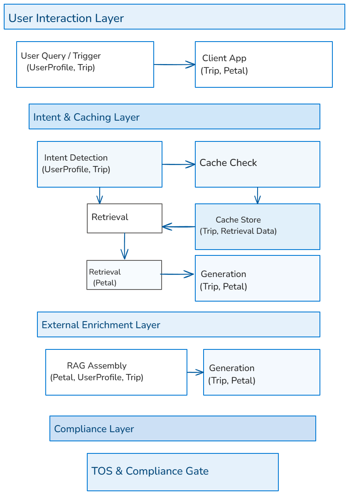

# RAG Flow Diagram

Visual diagram for the current RAG + caching interactions.

Source editable file: `rag_flow.excalidraw` (exported to `rag_flow.png`).

> Legacy extended diagram with storage emphasis lives in `architecture/README.md`.
