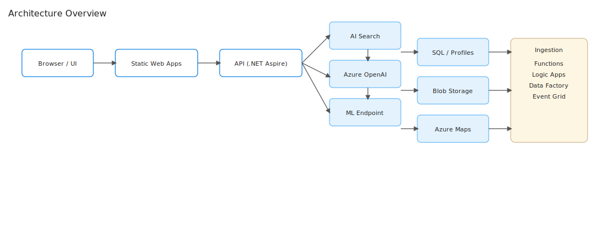

# System Context Diagram (Canonical)

High-level context for BloomTrip within its user, external data, and platform ecosystem.

| Actor / System | Interaction | Notes |
|----------------|------------|-------|
| End User | Web UI (browse, refine, feedback) | Auth (future) via OIDC |
| External Data APIs | Weather, Events, Social, Maps | Rate limits enforced; cached raw payloads |
| Embedding / LLM API | OpenAI (Azure) | Embeddings + generation |
| Search Index | Cognitive Search | Hybrid search + vector |
| Relational Store | Azure SQL | Normalized petals, trips, profiles |
| Object Store | Blob Storage | Raw + media + logs (select) |
| Observability Stack | App Insights / Log Analytics | Metrics, traces, alerts |

Scope boundary: Frontend + API + Retrieval + RAG Orchestration + Data pipeline inside; external providers & users outside.

Last updated: September 2025
