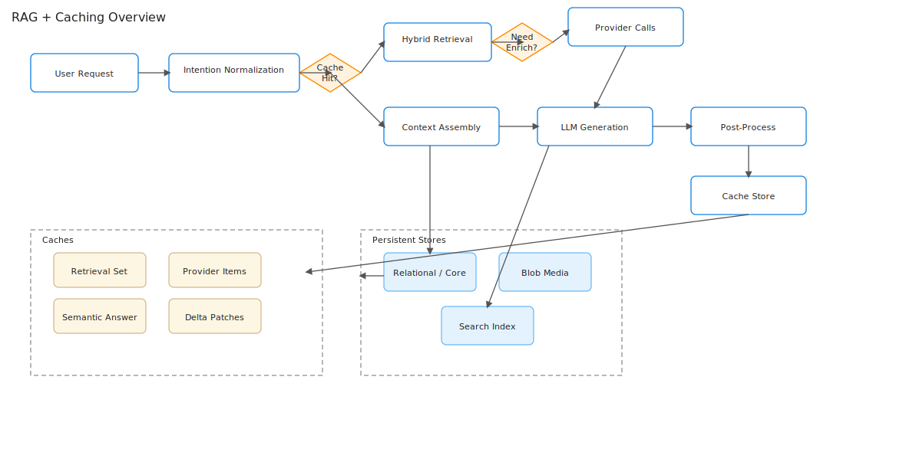

# RAG Data Flow (Canonical)

Canonical decomposition of the retrieval + generation pipeline. Supersedes monolithic legacy page `../rag_pipeline.md`.

> Intent + profile (+ optional trip context) → cache lookup → hybrid retrieval → conditional enrichment → context assembly → LLM generation → attribution & compliance → cache store → client delivery.



*Figure: High-level RAG + caching overview. Blue = processing stages, gold = decisions, tan = caches, teal = persistent stores.*

---
## 1. Hashing & Cache Keys

Each cache key uses a stable 64-bit FNV or Murmur hash of a canonical JSON subset. Version suffixes bump when prompt or template semantics change.

Cache entries:
- Retrieval set (petal IDs + metadata snapshot)
- Generated answer (trip draft or recommendation set)

Eviction / TTL (initial):
- Retrieval: 30–120 min (volatile sources shorter)
- Generation: 10–30 min unless user-saved

## 2. Retrieval Strategy

Primary: Azure Cognitive Search hybrid (BM25 + vector). Server-side filters: geo radius, tags, seasonality, accessibility.

Diversification heuristic: if top 8 share >60% identical tag set, replace lowest 2 with high-distance `related_petals` to enhance thematic variety.

Ranking blend (heuristic v1):
```text
score = 0.55 * vector_score + 0.35 * bm25 + 0.10 * recency_decay
```
Future: learned-to-rank on interaction feedback.

Failure handling:
- Empty result → broaden filters once (geo widen, relax tag strictness)
- API timeout → fallback to cached retrieval (<1h old)

## 3. External Enrichment Decision Matrix

Trigger enrichment only if:
- Missing critical fields (opening_hours, pricing_tier)
- `last_updated` stale (>7d events, >30d attractions)
- License flag requires refreshed attribution

Controls: token bucket per provider; circuit breaker after consecutive failures.

## 4. Context Assembly Templates

Blocks:
1. User preference summary
2. Trip scaffold (dates, companions, constraints)
3. Petal snippets (top N grouped by thematic cluster)
4. Preference summary (favorite tags, companions, travel modes)
5. Safety / license directives

Budget: target < 6k input tokens (reserve generation headroom).

## 5. Prompt Strategy & Safety Filters

Sections:
- System (role & compliance constraints)
- Context (assembled blocks)
- Instruction (output format JSON itinerary or bullet recommendations)

Safety:
- Regex/policy filter post-generation
- Mandatory attribution enforcement before return

## 6. Response Post-Processing & Attribution

Steps:
1. Parse JSON (repair prompt retry if invalid)
2. Attach source & license metadata per petal
3. Insert AI generation disclaimers
4. Compute quality score (coverage, diversity, personalization alignment)

## 7. Metrics & Observability

| Metric | Target (MVP) | Notes |
|--------|--------------|-------|
| P95 end-to-end latency | < 1200 ms | Warm cache path ~500–700 ms |
| Cache hit ratio (retrieval) | > 55% | Cost efficiency lever |
| Generation token cost / req | < $0.25 | Track per intent type |
| Invalid JSON rate | < 3% | Trigger prompt revision above |
| Enrichment call success | > 98% | After retries |
| Diversification applied rate | 10–25% | Healthy exploration range |

Tracing: correlate `intent_id` across classification → retrieval → generation.

## 8. Future Optimizations

- Learned re-ranking model
- Multi-vector field indexing
- Adaptive cache TTL (volatility score)
- Structured function calling for JSON validation
- Distillation for cheaper re-ranker
- Daily preference embedding refresh

---
Last updated: September 2025
