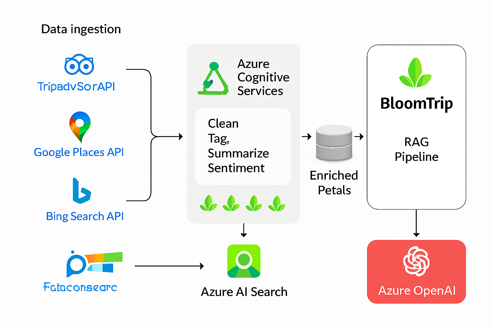

# Feasibility on Azure

Yes — the BloomTrip product vision is fully achievable on Azure using managed services that cover retrieval, generation, geospatial intelligence, data ingestion, caching, personalization, and compliance controls.

---

*Figure 9. Azure feasibility architecture overview: ingestion (Functions/Logic Apps) → normalization & enrichment (OpenAI/Cognitive Services) → indexing & retrieval (AI Search hybrid + semantic) → generation (Azure OpenAI) → caching (Redis tiers) → delivery (SPA + APIs + Maps) with governance (Key Vault, Monitor, Entra ID).*

??? note "Mermaid Text Fallback (Figure 9)"
	```mermaid
	flowchart LR
		subgraph Sources
			A1[Tripadvisor API]:::ext
			A2[Google Places]:::ext
			A3[Open Data (OSM/Wiki)]:::ext
			A4[User Feedback / UGC]
		end
		subgraph Ingestion
			F1[Functions Schedules]
			F2[Logic Apps Workflows]
		end
		subgraph Enrichment
			E1[Normalization Logic]
			E2[OpenAI Classification]
			E3[Cognitive Services (Vision/OCR)]
		end
		subgraph Storage
			S1[(Blob Raw)]
			S2[(Cosmos / PG Normalized)]
			S3[(Redis Caches)]
		end
		subgraph Retrieval
			R1[AI Search Index\nBM25 + Vector + Filters]
		end
		subgraph Generation
			G1[Azure OpenAI GPT]
		end
		subgraph Delivery
			D1[API (Functions/Container Apps)]
			D2[Web SPA]
			D3[Navigation Deep Links]
		end
		subgraph Governance
			K1[Key Vault]
			M1[App Insights/Monitor]
			I1[Entra ID]
		end

		Sources --> Ingestion --> Enrichment --> Storage --> Retrieval --> Generation --> Delivery
		R1 --> G1
		G1 --> S3
		S3 --> D1
		D1 --> D2
		D1 --> D3
		K1 --> D1
		I1 --> D1
		M1 --> D1

		classDef ext fill=#EEE,stroke=#999,color=#333;
	```
---
## 1. Core Azure Service Alignment

| Capability | Azure Service(s) | Role in BloomTrip |
|------------|------------------|-------------------|
| Hybrid Search (BM25 + Vector + Semantic) | Azure AI Search (vector + semantic ranker) | Retrieve petals, trips, guides, events for RAG and swaps |
| Embeddings & Generation | Azure OpenAI (Embeddings + GPT) | Create itinerary drafts, refinement deltas, summaries |
| Geospatial Maps, Routing, Isochrones | Azure Maps | Tiles, routes, distance matrix, traffic, weather layers |
| Ingestion / Orchestration | Azure Functions, Logic Apps, Data Factory | Scheduled pulls, ETL, enrichment pipelines |
| Low‑latency Caching | Azure Cache for Redis | API result cache, semantic response cache, retrieval set cache |
| Primary Data Stores | Azure Cosmos DB (NoSQL) / Azure PostgreSQL | Petals, trips, user library, activity feedback, normalized POI metadata |
| Object / Raw Storage | Azure Blob Storage | Raw source JSON, media assets, archived prompts, embeddings backup |
| Auth / Identity | Microsoft Entra ID (B2C or external IdP) | User auth, admin console, service-to-service OIDC |
| Observability | Application Insights, Log Analytics, Azure Monitor | Latency, errors, cost telemetry, custom RAG metrics |
| Secrets & Keys | Azure Key Vault | API keys (Tripadvisor, Google Places, Maps), OpenAI keys |
| Background Jobs | Azure Container Apps Jobs / Functions timers | Nightly ranking refresh, popularity model update |
| Personalization / ML Ops (future) | Azure Machine Learning | Train + deploy ranking / personalization models |

---
## 2. Third‑Party / External Provider Integration

| Provider | Use | Notes / TOS Considerations |
|----------|-----|---------------------------|
| Tripadvisor Content API | Rich POI metadata, ratings, categories | Partner access; cache only permitted fields + TTL; store stable IDs |
| Google Places / Geocoding | POI lookup, details, photos metadata | Store Place IDs, minimal cache; refetch on demand for restricted fields |
| Google / Apple / Waze | Navigation deep links | Pure client deep link = low risk (no data retention) |
| Azure Maps (alt to Google for routing) | Tiles, routing, isochrones | Single-vendor simplification; caching within terms |
| Bing / Web Search APIs | Discovery of candidate sources | Treat results as pointers; crawl only licensable pages |
| OpenStreetMap / Overpass | Base open POI + trails | Attribute per ODbL; retain raw + normalized forms |
| Wikivoyage / Wikipedia / Wikidata | Descriptive + structured context | Respect CC BY-SA / attribution; avoid storing full articles verbatim in generated output |
| Eventbrite / Meetup (future) | Local events enrichment | Rate limits; map to Petal event subtype |

> Tip: Implement a `PlacesProvider` interface (e.g. `getPlace(id)`, `searchPlaces(bounds, filters)`) so adapters for Tripadvisor, Google, Azure Maps remain swappable.

---
## 3. Open & Extensible Data Sources

- Tourism board feeds (events, seasonal closures)
- GTFS transit feeds for travel time context
- User-generated petals (ratings, notes, discoveries)
- Strava / Komoot / AllTrails (licensed) route metadata (future)

Normalize everything into a unified **Petal Schema** (already defined elsewhere) capturing: core identity, geo, tags, seasonality, family/pet flags, source, license flags, freshness timestamp.

---
## 4. RAG Architecture on Azure (High-Level Phases)

| Phase | Steps | Azure Components |
|-------|-------|------------------|
| Ingest | Fetch → validate → persist raw | Functions / Logic Apps → Blob |
| Normalize | Transform → classify → tag (OpenAI) | Functions + OpenAI + Cosmos/PostgreSQL |
| Index | Embed → upsert vectors + filters | OpenAI Embeddings + AI Search |
| Retrieve | Hybrid (vector + BM25 + filters) + semantic rank | AI Search Semantic + Vector combo |
| Generate | Compose prompt (context slices + user prefs) | Azure OpenAI (GPT) |
| Delta Refine | Constrained segment update prompts | Azure OpenAI + minimal retrieval scope |
| Observe | Log tokens, latency, retrieval hit ratio | App Insights + custom metrics |

Safety: Always include citations (Petal IDs, sources) so generated text can be audited and reinforced.

---
## 5. Caching Strategy Layers (Cache‑Augmented Generation)

| Layer | Key | TTL | Store | Purpose |
|-------|-----|-----|-------|---------|
| Provider API | provider:place:{id} | Minutes–Hours (per TOS) | Redis | Reduce external API spend |
| Retrieval Set | retrieval:intent_hash:{hash} | 1–6h | Redis | Avoid requerying index for frequent intents |
| Semantic Response | semantic:trip_seed:{hash} | 6–24h | Redis | Reuse stable itinerary drafts for similar prompts |
| Delta Patch | delta:segments:{tripId}:{scopeHash} | 1h | Redis | Faster rollback / replay of refinements |
| Popular Petals Snapshot | popularity:region:{regionId} | 30–60m | Redis | Low-latency surfacing on homepage / rails |

Invalidation Triggers: petal edit, new rating, stale freshness timestamp, source update event, seasonal boundary crossing.

---
## 6. Maps & Navigation Integration

Rendering & planning can use Azure Maps (or dual provider abstraction). Deep links remain client side:

| Provider | Deep Link Pattern |
|----------|-------------------|
| Google Maps | `https://www.google.com/maps/dir/?api=1&origin=LAT1,LON1&destination=LATN,LONN&waypoints=LAT2,LON2\|LAT3,LON3` |
| Apple Maps | `maps://?saddr=LAT1,LON1&daddr=LATN,LONN` |
| Waze | `https://waze.com/ul?ll=LATN,LONN&navigate=yes` |

Waypoint Compression: prioritize origin, final destination, must-keep petals, overnights, longest duration, high scenic rating.

---
 
## 7. Practical Implementation Path

1. Finalize Petal schema & implement normalization pipeline
2. Stand up Azure AI Search index (vector + semantic) with pilot dataset
3. Add OpenAI embedding + generation flow for initial itinerary creation
4. Implement Redis caching scaffolding (provider, retrieval, semantic tiers)
5. Build Map provider abstraction & deep link navigation picker
6. Instrument telemetry (token usage, retrieval latency, cache hit rate)
7. Add feedback ingest (survey) → update Popular Petals ranking nightly

---
## 8. Azure Cognitive Services Value Add

| Category | Service | BloomTrip Use |
|----------|---------|--------------|
| Vision | Computer Vision / Image Analysis | Auto-tag user / partner images (lake, forest, indoor) |
| Vision | OCR (Read) | Extract text from signage / menus for metadata enrichment |
| Language | Text Analytics (Sentiment) | Weight POI quality; filter low-sentiment notes |
| Language | Summarization | Compress long reviews into concise blurbs |
| Language | Entity Linking | Connect unstructured text to canonical places / events |
| Language | Translator | Localize descriptions & prompts |
| Speech | Speech to Text | Voice-driven trip idea capture |
| Speech | Text to Speech | Audio narration of itinerary or navigation hints |
| Decision | Personalizer / Custom models | Future adaptive ranking of suggestions |
| Search | Bing Autosuggest / Web / Images | Discover emerging events / enrich content candidates |

---
## 9. RAG + Cognitive Services Pipeline (Augmented)

1. Ingest raw source → store Blob.
2. Vision/OCR tagging & entity linking augment raw metadata.
3. Generate embeddings → upsert searchable + filter fields.
4. Query: parse user intent → semantic + vector hybrid retrieval.
5. Re-rank (semantic ranker + optional learned ranker) → slice top context.
6. Prompt assembly (citations + constraints) → OpenAI generation.
7. Post-process: citation verification, PII scrub, caching.
8. Log metrics & feedback loops (ratings update embeddings periodically / nightly retrain).

---
## 10. Governance & Compliance Considerations

| Aspect | Control |
|--------|---------|
| Provider TOS | Metadata field-level flags (cacheable, ttl, rehydrate) |
| PII | Basic regex + Cognitive Services detection pipeline before storage |
| Attribution | Automatic footer injection for OSM / Wikivoyage derived content |
| Data Residency | Select Azure region matching majority user base; replicate read-only search to secondary region |
| Cost Guardrails | Daily budgets: OpenAI tokens, Search queries, Redis memory; alerts via Monitor |
| Security | Key Vault rotation + managed identities for Functions / Container Apps |

---
## 11. Suggested Reference Architecture (Conceptual Layers)

| Layer | Components | Notes |
|-------|-----------|-------|
| Edge / Client | Web SPA (React), Mobile shell (future) | Uses provider deep links for navigation |
| API / Orchestration | Azure Functions + Minimal API / Container Apps | Auth via Entra ID; throttling + caching |
| Data & Content | Cosmos DB, PostgreSQL, Blob Storage | Separation of raw vs normalized content |
| Intelligence | Azure AI Search, Azure OpenAI, Cognitive Services | RAG + enrichment + classification |
| Caching | Redis (tiered namespaces) | Key tagging for targeted invalidation |
| Analytics & Ops | App Insights, Log Analytics, Monitor, Cost Mgmt | Unified dashboard (latency, cost, freshness) |
| Security & Compliance | Key Vault, Entra ID, Defender for Cloud | Least privilege RBAC, secret isolation |

---
## 12. Future Enhancements

- Personalized ranking model (Azure ML) trained on feedback & usage.
- On-device vector pruning (mobile offline mode) for cached recent petals.
- Multi-lingual itinerary generation with dynamic translation fallback.
- Route optimization with constraints (EV charging, daylight windows).
- Real-time event injection (webhooks) into active itineraries.

---
## 13. Cross-Links

`04_solution-design.md` • `rag_pipeline.md` • `architecture/azure_overview.md` • `mockups/trip-feedback-survey.md`

---
Last updated: 2025-09-05
