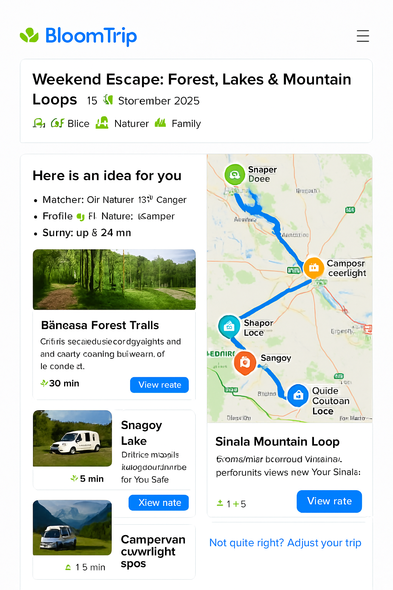
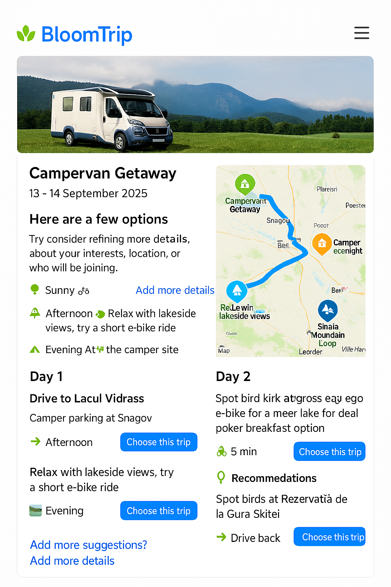

# Itinerary Page Mockup: Forest, Lakes & Mountain Loops


*Figure 3. Core itinerary detail layout with dual column: editable day segments (left) and interactive map with custom BloomTrip markers (right).*

> BloomTrip-style detailed itinerary view with embedded map (Google or Bing) highlighting Băneasa Forest trails, Snagov Lake, Moara Vlăsiei, and mountain loops near Sinaia using a custom rounded, nature‑inspired icon set.

---

## 1. Purpose & Position in Flow

This page appears after a user taps **“Choose this trip”** from a divergent / broad results screen (see `search-refinement.md`). It transitions the user from *idea exploration* to *trip planning ownership*.

Key goals:

- Provide immediate visual context (hero + interactive map).
- Explain “Why it matches” (transparency + trust).
- Offer structured, editable Day-by-Day plan.
- Enable lightweight personalization before commitment (swap, adjust duration, companions, budget lens).
- Instrument feedback loops (Save, Boost Similar, Mute, Explain Choice).

---

## 2. Page Structure (High-Level Wire Blocks)

1. **Header Card**: Title, date window selector, profile tags, weather snippet.
2. **Match Rationale Panel**: Signals that fired (interests, weather window, distance radius).
3. **Dual Layout Region** (responsive):
   - Left: Day / Segment cards (scrollable column).
   - Right: Embedded Map (sticky on desktop, collapsible on mobile).
4. **Personalization Tray**: Inline controls (Swap, Add Day, Adjust Pace, Budget Filter toggle).
5. **Logistics Strip**: Drive segments, charging points, facilities.
6. **Save / Share / Export Bar**.
7. **Feedback Footer**: Micro-actions + “Not quite right? Adjust your trip”.

---

## 3. Map Integration Options

| Aspect | Google Maps JS API | Bing Maps Web Control | Neutral (Leaflet / Vector Tiles) |
|--------|--------------------|-----------------------|----------------------------------|
| Route Rendering | Directions + polylines styling | Directions + custom layer | Use precomputed polyline / GeoJSON |
| Custom Icons | `new google.maps.Marker({icon: svg})` | `Microsoft.Maps.Pushpin` w/ SVG | Full SVG markers via layer |
| Offline / Caching Strategy | Limited (Terms) | Limited | Tile + route caching possible |
| Licensing | API key / usage based | Key w/ usage tiers | Depends on tile source |

**Decision (MVP)**: Support Google + Bing provider abstraction via a `MapProvider` interface so itinerary JSON is provider-agnostic.

```ts
interface MapProvider {
  init(container: HTMLElement, opts: { center: [number, number]; zoom: number }): Promise<void>;
  addMarker(poi: PoiMarker): void;
  addRoute(route: EncodedRoute | GeoJSON.FeatureCollection): void;
  highlight(id: string): void;
  fitTo(ids: string[]): void;
}
```

---

## 4. Custom Icon System

Design principles: rounded corners, subtle shadow (elevation 1), saturated organic palette, white inner pictogram.

| Semantic | Color (Hex) | Icon Concept | Example ID |
|----------|-------------|--------------|------------|
| Forest Trail | `#2E8F48` | Leaf / path swirl | `poi_forest` |
| Lake / Water | `#0D84D9` | Gentle wave triple | `poi_lake` |
| Cultural Stop | `#FF8A34` | Stylized arch / column | `poi_culture` |
| Camp / Camper | `#1B74D2` (outline) + green dot | Camper silhouette | `poi_camper` |
| Scenic View | `#6F4DF5` | Mountain + sun | `poi_view` |

**SVG Marker Template (12px corner radius)**:

```svg
<svg width="48" height="56" viewBox="0 0 48 56" fill="none" xmlns="http://www.w3.org/2000/svg">
  <defs>
    <filter id="drop1" x="-4" y="-4" width="56" height="64" filterUnits="userSpaceOnUse">
      <feOffset dy="2"/><feGaussianBlur stdDeviation="2"/><feColorMatrix type="matrix" values="0 0 0 0 0  0 0 0 0 0  0 0 0 0 0  0 0 0 0.15 0"/><feBlend mode="normal" in2="BackgroundImageFix" result="shadow"/>
    </filter>
  </defs>
  <g filter="url(#drop1)">
    <path d="M24 56c8-14.4 22-20.4 22-34A22 22 0 0 0 2 22c0 13.6 14 19.6 22 34Z" fill="#2E8F48"/>
    <circle cx="24" cy="22" r="12" fill="white"/>
    <!-- Replace inner glyph -->
    <path d="M20 26c4-6 4-10 8-12-1 4-1 8-8 12Z" fill="#2E8F48"/>
  </g>
</svg>
```

Replace color + internal glyph per semantic.

---

## 5. Sample Itinerary Map Payload (Provider-Agnostic)

```json
{
  "tripId": "forest_lake_mountain_weekend_2025_09_13",
  "center": [44.65, 26.20],
  "zoom": 8,
  "pois": [
    {"id": "baneasa_forest", "name": "Băneasa Forest Trails", "kind": "forest", "coords": [44.5299, 26.0802], "activities": ["e-bike","nature"], "durationMin": 30},
    {"id": "snagov_lake", "name": "Snagov Lake", "kind": "lake", "coords": [44.6944, 26.1900], "activities": ["picnic","kayak"], "durationMin": 60},
    {"id": "moara_vlasiei", "name": "Moara Vlăsiei", "kind": "culture", "coords": [44.6805, 26.0487], "activities": ["ride","lunch"], "durationMin": 45},
    {"id": "sinaia_loop", "name": "Sinaia Mountain Loop", "kind": "view", "coords": [45.3506, 25.5474], "activities": ["trail","scenic"], "durationMin": 120}
  ],
  "routes": [
    {"id": "segment_day1_forest_to_snagov", "polyline": "_seI}u~hC...", "color": "#0D84D9", "mode": "drive"},
    {"id": "segment_day2_snagov_to_sinaia", "polyline": "ymvJc`d~E...", "color": "#2E8F48", "mode": "drive"}
  ],
  "meta": {"units": "metric", "generatedAt": "2025-09-05T08:30:00Z"}
}
```

(Polylines truncated.)

---

## 6. Embedding Examples

### Google Maps (simplified)

```html
<div id="map" style="height:480px"></div>
<script src="https://maps.googleapis.com/maps/api/js?key=YOUR_KEY&libraries=maps"></script>
<script type="module">
  import data from './itinerary.json' assert { type: 'json' };
  const map = new google.maps.Map(document.getElementById('map'), {center:{lat:data.center[0],lng:data.center[1]}, zoom:data.zoom});
  const iconFor = kind => ({ url: `/icons/${kind}.svg`, scaledSize: new google.maps.Size(48,56) });
  data.pois.forEach(p => new google.maps.Marker({map, position:{lat:p.coords[0],lng:p.coords[1]}, icon: iconFor(p.kind), title: p.name}));
  // Decode polyline example (requires polyline decoder util)
</script>
```

### Bing Maps (simplified)

```html
<div id="map" style="height:480px"></div>
<script type="text/javascript" src="https://www.bing.com/api/maps/mapcontrol?key=YOUR_KEY" async defer></script>
<script>
function loadMapScenario(){
  fetch('itinerary.json').then(r=>r.json()).then(data => {
    const map = new Microsoft.Maps.Map('#map',{ center: new Microsoft.Maps.Location(data.center[0], data.center[1]), zoom: data.zoom });
    data.pois.forEach(p => {
      const pin = new Microsoft.Maps.Pushpin(new Microsoft.Maps.Location(p.coords[0], p.coords[1]), { icon: `/icons/${p.kind}.svg`, anchor: new Microsoft.Maps.Point(24,56) });
      map.entities.push(pin);
    });
  });
}
</script>
```

---

## 7. Interaction Model



| Action | Result |
|--------|--------|
| Hover / Tap POI card | Map marker pulses + route segment highlight (thicker stroke) |
| Map marker click | Scrolls corresponding segment card into view + brief rationale toast |
| Swap Activity | Opens modal listing compatible alternatives (same difficulty tag) |
| Adjust Duration | Regenerates affected route segments + recalculates drive time slack |
| Budget Filter | Re-colors costlier POIs (amber) + suggests cheaper substitutes |
| Save / Boost Similar | Stores vector embedding for reinforcement + logs telemetry |

Keyboard support: `Tab` cycles markers → pressing `Enter` focuses card. ARIA labels include `name, activity types, estimated duration`.

---

## 8. Accessibility & Internationalization

- WCAG AA contrast for marker inner glyph (white on saturated base > 4.5:1). 
- Provide text alt list of POIs beneath map for screen readers.
- Use locale-aware formatting for distance/time (e.g., km vs mi).
- Diacritics preserved for Romanian names (UTF‑8, no ASCII fallback).

---

## 9. Performance Considerations

| Concern | Mitigation |
|---------|------------|
| First Paint Delay | Lazy-load map script after header visible (`IntersectionObserver`). |
| Marker Jank | Batch marker adds inside `requestIdleCallback` for large sets. |
| Excess Route Decoding | Pre-simplify polylines server-side (Douglas-Peucker). |
| Mobile Memory | Offer static preview image → tap to load full map. |

---

## 10. Telemetry Events

| Event | Payload Snippet |
|-------|-----------------|
| `itinerary_view` | `{ tripId, profileTags, weatherWindow }` |
| `poi_focus` | `{ tripId, poiId, source: 'map|list' }` |
| `swap_requested` | `{ tripId, segmentId, originalPoiId }` |
| `duration_adjust` | `{ tripId, deltaDays }` |
| `export_invoke` | `{ tripId, format: 'pdf|calendar' }` |
| `feedback_action` | `{ tripId, targetId, action: 'save|boost|mute' }` |

---

## 11. Data Model Alignment

Each POI maps to a `Petal` (see `specs/petal_schema.md`) and segments aggregate petals into a `TripDay`. Route metadata supplements petal relational edges (sequence + segment travel mode).

---

## 12. Future Enhancements

- Offline snapshot (static vector tile + simplified polylines).
- 3D terrain preview for mountain segments.
- Battery consumption estimator for e‑bike legs.
- Collaborative live editing (WebSocket diff sync).
- Heatmap overlay (popular paths vs personal recommendations).

---

## 13. Cross-Links

- Source Itinerary Preview: `weekend-bucharest-ebike.md`
- Divergent Search Entry Point: `search-refinement.md`
- RAG Flow & Caching: `rag_pipeline.md` (for regeneration triggers)

---

_Last updated: 2025-09-05_
