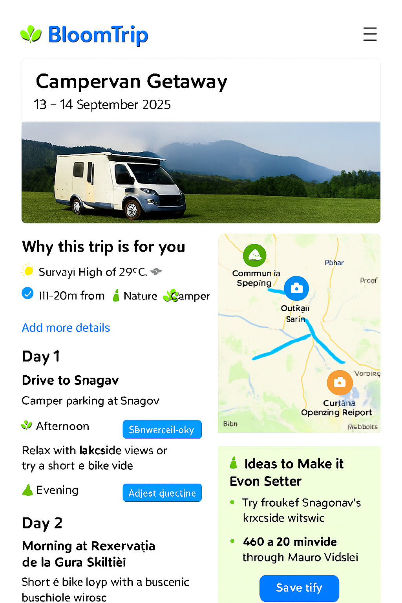
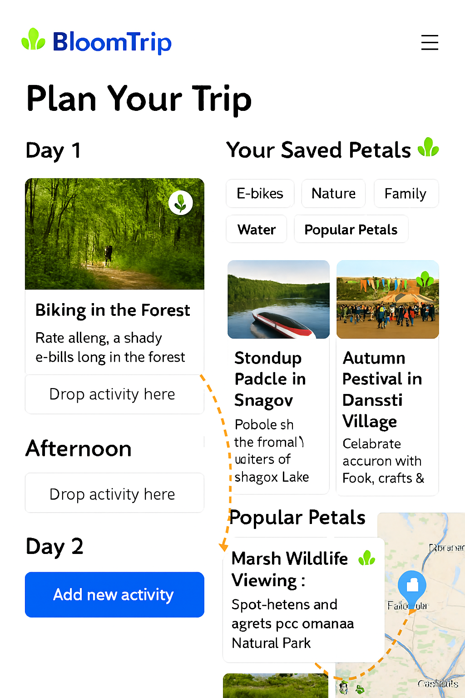

# Itinerary Detail & Refinement Mockup


*Figure 4. Enhanced itinerary refinement view with smart suggestions panel, refinement rail, and synchronized map/segment interactions.*

> This mockup extends the base itinerary map page by adding real‑time refinement, smart enhancement suggestions, and feedback instrumentation so a static idea becomes a living, user‑shaped plan.

---

## 1. Purpose

Transform a selected suggestion ("Choose this trip") into an interactive planning surface where the user can: tweak scope, swap activities, extend or shrink duration, inject companions or constraints, and immediately see regenerated rationale — all while preserving provenance (sources) and personalization continuity.

---

## 2. Page Layout Regions

| Region | Description | Key Components |
|--------|-------------|----------------|
| A. Header Card | Title, date window selector, profile match badges | Trip title, date picker, badges (E‑Bike, Nature, Camper, Family) |
| B. Hero Media | Large hero image or carousel (forest, lake, camper) | Responsive image, optional video teaser |
| C. Refinement Rail | Always‑visible quick actions | Add Details, Adjust Duration, Swap Activity, Add Companions, Budget Filter, Weather Mode Toggle |
| D. Smart Suggestions Panel | Dynamic improvement ideas | "Ideas to Make It Even Better" card with contextual chips |
| E. Day / Segment Column | Ordered day blocks with editable segments | Segment cards, drag handle, time badges, action menu |
| F. Interactive Map | POIs + routes + overlays (sticky/right) | Custom SVG markers, route polylines, layer toggles |
| G. Action Footer | Persistence & collaboration | Save, Share, Export, Adjust Again |
| H. Feedback Micro Bar | Reinforcement signals | Save, Boost, Mute, Explain buttons per segment |

---

## 3. Refinement Actions & UX Flows

| Action | UX Pattern | Backend Impact |
|--------|-----------|----------------|
| Add Details | Inline prompt (natural language) | Triggers RAG adjust prompt; stores refinement intent token |
| Adjust Duration | Dropdown (1–4 days) or slider | Re-query candidate POIs for added/removed days; recalc drive & rest windows |
| Swap Activity | Modal with filtered alternatives (same tags) | Replacement logged; original kept for undo; feedback event `swap_activity` |
| Add Companions | Chip selector (Kids, Teen, Pet, Friends) | Re-scores family_fit & safety tags; updates user profile delta |
| Budget Filter | Range control (Low ↔ Higher) | Filters cost_band, suggests substitutes; caches previous plan for revert |
| Weather Mode | Toggle (Outdoor / Mixed / Indoor fallback) | Adjusts weather_suitability weighting + alternative retrieval |

---

## 4. Smart Suggestions (“Ideas to Make It Even Better”)

Dynamic chips generated from context gaps:

- "Add a scenic detour" (if elevation scenic score low)
- "Include a kid challenge stop" (if teen flag true & no active challenge)
- "Add a low‑light indoor fallback" (if afternoon showers risk)
- "Insert a local food stop" (if no dining anchor on Day 1)

Each chip triggers a lightweight retrieval + localized partial regeneration rather than full itinerary rewrite (scope control reduces token cost & latency).

---

## 5. Segment Card Structure

```text
<SegmentCard>
  Icon (semantic color)
  Title (e.g., Băneasa Forest Loop)
  Tags: [E‑Bike][Forest][Shaded]
  Time Block: 09:00–11:00 (editable)
  Distance / Elev Gain / Drive Time Chips
  Rationale (1 sentence) + (Explain) link
  Inline Actions: Save | Boost | Mute | Swap | Move | Details
</SegmentCard>
```

**Inline edit affordances:** time picker, duration drop‑down, optional notes field.

---

## 6. Map Enhancements

| Feature | Behavior |
|---------|----------|
| Marker Hover / Card Sync | Hover highlights card; focus scrolls into view |
| Layer Toggles | Food • Scenic • Family • Charging • Weather Risk |
| Route Segments | Color-coded by day (Day1 blue, Day2 green, etc.) |
| Offline Preview | Static image fallback before script load |
| Selection Add | Clicking empty map area opens "Add Nearby Stop" search (radius preset) |

---

## 7. Custom Marker Palette (BloomTrip)

| Kind | Base Color | Inner Glyph |
|------|------------|-------------|
| Forest / Trail | #2E8F48 | Leaf / path swirl |
| Lake / Water | #0D84D9 | Wave triple |
| Scenic View | #6F4DF5 | Mountain + sun |
| Camper / Overnight | #1B74D2 | Camper silhouette |
| Food / Local | #FF7043 | Utensils rounded |
| Cultural / Heritage | #FDBA4D | Arch / column |
| Fallback / Indoor | #455A64 | Roof silhouette |

*All markers share 48×56 rounded pin SVG with white inner circle.*

---

## 8. Adjust Prompt Template (Delta Regeneration)

```text
System: You are a precise trip refinement planner. Modify ONLY the specified parts; preserve unchanged segments & original sources. Cite sources.
User: Original segment JSON (abbrev)...
Adjustment: "Add a lakeside picnic stop after the forest loop and shorten the afternoon ride."
Constraints: Drive time ≤ 2h/day; family + teen; e‑bike friendly focus.
Return: Updated segments array + rationale deltas per changed segment.
```

---

## 9. Telemetry Events

| Event | Payload Example |
|-------|-----------------|
| itinerary_refine | {tripId, userId, action:"add_details", tokens, latencyMs} |
| segment_swap | {tripId, segmentId, oldPoi, newPoi} |
| duration_change | {tripId, oldDays, newDays} |
| chip_apply | {tripId, chipType} |
| map_marker_focus | {tripId, poiId, source:"map_or_card"} |
| export_invoke | {tripId, format:"pdf_or_calendar"} |

---

## 10. Performance & Cost Notes

| Concern | Mitigation |
|---------|------------|
| Full itinerary re-generation | Delta prompts (segment scope) |
| Excess embeddings | Cache POI embeddings; only embed new user free‑text additions |
| Map script weight | Lazy load after first interaction / hero in view |
| Ranking latency | Pre-rank alternative POIs nightly; in-session only apply lightweight re-score |

---

## 11. Accessibility

- All actions reachable via keyboard (Tab → segment → Enter to expand actions)
- ARIA roles: list (segments), listitem (segment), button (swap/add)
- High contrast marker glyphs (WCAG AA)
- Motion reduction: disable map marker pulse when reduced motion enabled

---

## 12. Cross-Links

- Base Itinerary Map Concept: `itinerary-map-page.md`
- Divergent Search Entry: `search-refinement.md`
- Source Preview Example: `weekend-bucharest-ebike.md`

---
Last updated: 2025-09-05

---

## 13. Live Petals Drag & Drop Interaction


*Figure 5. Live Petals drag‑and‑drop: user drags a saved / popular Petal from the suggestions rail onto a specific day segment; the segment inserts inline, route polyline + ordering update in real time, and a delta regeneration prompt updates only affected rationale.*

### Purpose

Accelerate micro-adjustments by letting users visually compose itineraries: add, reorder, or replace activities ("Petals") directly on the map or within the day column without a full textual prompt.


### Interaction Flow

1. User hovers a Petal chip (Saved or Popular) → map highlights candidate insertion anchors (gap markers between existing segments).
1. Drag start emits `petal_drag_start` telemetry; route preview ghost line renders (dashed).
1. Drop onto a gap (inserts new segment with provisional time estimate) or onto an existing segment (opens swap mini‑modal to confirm replace vs insert position).
1. System issues a constrained delta prompt containing ONLY impacted segments (preceding + new + following) for rationale + timing recalculation.
1. UI optimistic‑updates ordering & route polyline; reconciliation occurs when regeneration returns (diff merges if minor duration drift).

### Key Constraints

- Max 2 concurrent optimistic insertions (queue additional interactions with subtle toast).
- Reject drop if added drive time would exceed daily limit (pre-check distance matrix estimate < threshold).
- Maintain provenance: newly inserted Petal retains source + popularity metadata.

### Visual Cues

| State | Cue |
|-------|-----|
| Drag Hover (valid) | Anchor slot glows + subtle scale |
| Drag Hover (invalid) | Slot shows red outline + pulse |
| Optimistic Insert | Segment card skeleton shimmer |
| Reconciled | Brief green check icon fade-in |

### Telemetry Additions

| Event | Payload |
|-------|---------|
| petal_drag_start | {tripId, petalId, source:"saved\|popular"} |
| petal_drag_cancel | {tripId, petalId, durationMs} |
| petal_insert | {tripId, petalId, positionIndex, optimistic:true} |
| petal_swap | {tripId, oldSegmentId, newPetalId} |
| delta_regen_invoke | {tripId, scope:"segments", count:3, tokens} |

### Delta Prompt (Insert Example)

```text
System: You are an itinerary delta adjuster. Recalculate ONLY timing + rationale for affected window.
Context: JSON for segments 3–5 (before insertion) + new Petal metadata.
User Action: Inserted petal_id=snagov_picnic after segment 3.
Constraints: Keep total daily drive ≤ 2h, preserve prior segment ordering.
Return: Updated segments 3–6 (ISO start times, durations, rationale_deltas[]).
```

### Error / Conflict Handling

- If regeneration increases drive time beyond constraint: revert insertion (toast: "Couldn’t fit that — try a closer stop").
- If user performs second drag before first delta resolves: show inline spinner badge on pending segment(s).

### Accessibility

- Petals list supports keyboard: Enter = pick up, Arrow keys = move focus among anchors, Space = drop.
- Live region announces: "Inserted Picnic Stop after Forest Loop."

---

Figure 5 added & section updated: 2025-09-05
