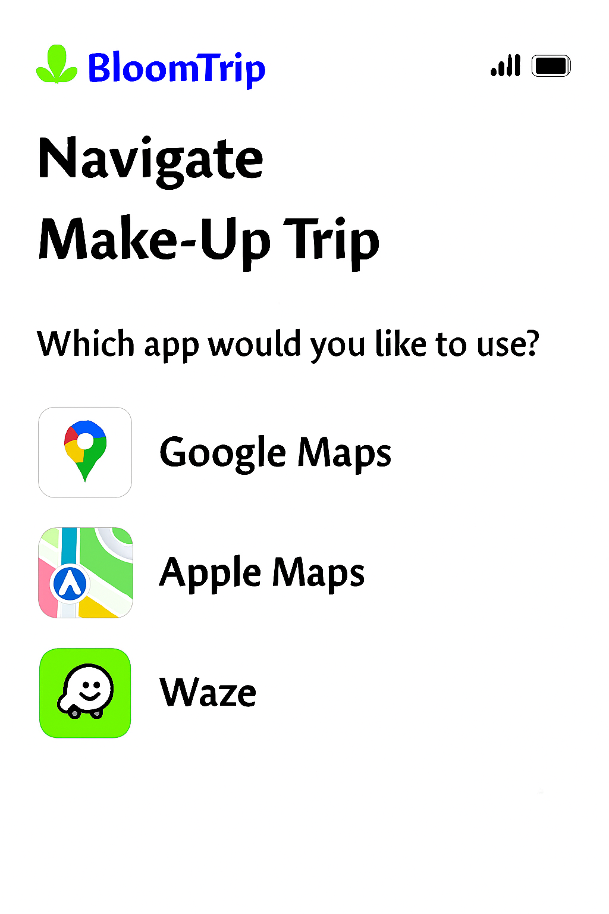

# Navigation Picker (Multi-App Launch Screen)

*Figure 7. Navigation Picker: post‑commit (or Resume > Navigate) screen offering Google Maps, Apple Maps, or Waze with preloaded route + waypoints and trip summary context.*

## 1. Purpose

Provide a frictionless handoff from planning to real-world movement. Users select their preferred navigation app and continue the itinerary with correct ordering of key Petals (POIs) and timing assumptions.

Appears when:

- User taps “Navigate” from: Trip In Progress (after save) or a committed trip view.
- User resumes a trip mid-route and requests directions.

## 2. Core Elements

| Element | Description | Notes |
|---------|-------------|-------|
| Title Block | “Navigate” + Trip Name | Trip name truncated w/ ellipsis after 1 line |
| Prompt | “Which app would you like to use?” | Localized string key: `nav_picker.prompt` |
| App Option Cards | Icon + Label + Right Arrow (focusable) | Order = last used first (persisted) |
| Route Summary | Distance, total petals, estimated travel time | Travel time cached from last generation or on-demand calc |
| Context Chip Strip | Mode icons (🚐, 🚲) + companions tags | Reinforces personalization |
| Dismiss / Back | Returns user to trip view | ESC / swipe-down on mobile sheet variant |

## 3. Deep Link Formats

| Provider | Link Template | Waypoint Support | Notes |
|----------|---------------|------------------|-------|
| Google Maps | `https://www.google.com/maps/dir/?api=1&origin={lat1},{lon1}&destination={latN},{lonN}&waypoints={lat2},{lon2}\|...` | Up to ~10 consumer waypoints | Encode `travelmode=driving\|bicycling` when relevant |
| Apple Maps | `http://maps.apple.com/?saddr={lat1},{lon1}&daddr={latN},{lonN}` | Limited (multi via `daddr=lat,long+to:lat,long`) | Fallback: only origin/destination if > 1 mid stop |
| Waze | `https://waze.com/ul?ll={latN},{lonN}&navigate=yes` | Single destination | Sequential multi-stop: relaunch after each arrival (optional prompt) |

### Waypoint Compression Strategy

1. Always include origin (first segment start) and final destination (last overnight / end Petal).
2. Include intermediate high-value Petals (priority order: explicit user “must keep” flags > overnight > longest duration > scenic rating).
3. If waypoint limit exceeded: collapse adjacent low-impact stops into a single instruction summary note (shown in an inline tip before launch).

## 4. Route Summary Construction

| Metric | Source | Fallback |
|--------|--------|----------|
| Total Distance | Precomputed aggregator on commit | On-demand distance matrix if stale > 6h |
| Est Travel Time | Summed drive segments + buffer (traffic factor) | Live request to provider ETA API (if token budget) |
| Petal Count | Length of segment array (activity segments only) | n/a |
| Modes Present | Aggregated from segment tags | Derive from icons table |

## 5. Telemetry

| Event | Payload Example |
|-------|-----------------|
| nav_picker_view | {tripId, userId, candidateProviders:["google","apple","waze"], petals:11} |
| nav_picker_select | {tripId, provider:"google", waypoints:7} |
| nav_picker_limit_trim | {tripId, removed:3, kept:7} |
| nav_launch_error | {tripId, provider:"apple", code:"APP_NOT_AVAILABLE"} |
| nav_relaunch_next_stop | {tripId, provider:"waze", nextStopId:"snagov_lake"} |

## 6. Error / Edge Handling

| Scenario | Handling |
|----------|----------|
| App not installed (mobile) | Detect scheme failure → show inline sheet offering other apps + “Copy route link” |
| Excess waypoints | Apply compression strategy; show toast: “Simplified route (some short stops grouped).” |
| Offline / low connectivity | Present cached polyline static preview + allow copy coordinates |
| Mixed travel modes (e‑bike + drive) | Prefer `driving` for backbone; inject note: “Segment 3 is ride-only – switch to cycling after parking.” |
| Permission denied (location) | Prompt OS request; if denied, fallback to origin as first Petal coordinates |

## 7. Accessibility

- Each app card: role=button + `aria-label="Open in Google Maps"` style pattern.
- Keyboard order: top to bottom, Enter to launch, Space to focus details.
- Focus ring meets contrast AA (outline offset 2px, brand accent color).
- Voice summary preceding list: screen reader live region describing route summary.

## 8. Security & Privacy Notes

| Concern | Mitigation |
|---------|-----------|
| Leaking personal waypoint names in URL | Use sanitized short labels or omit names; rely on coordinates |
| Over-sharing user profile tags | Keep companions/mode local; not embedded in external link |
| Stale link reuse | Append ephemeral `ts` query param so analytics can detect outdated launches |

## 9. Future Enhancements

- Add “Copy GPX” / “Download KML” for advanced offline use.
- Offer cycling vs driving route toggle (Google & Apple only) prior to launch.
- Multi-day navigation segmentation (launch Day N subset only).
- Auto-detect installed apps and gray out unavailable options on desktop.

---
Figure 7 added: 2025-09-05 (image pending upload as `navigation-picker.png`)

## 10. Implementation Checklist (Dev Aid)

| Item | Status |
|------|--------|
| Decide waypoint selection heuristic | Planned |
| Implement provider detection (UA + scheme probe) | Planned |
| Add telemetry hooks | Planned |
| Compression & toast messaging | Planned |
| Accessible card semantics | Planned |

---
Cross-links: `trip-in-progress.md`, `itinerary-map-page.md`, `itinerary-refinement-detail.md`
