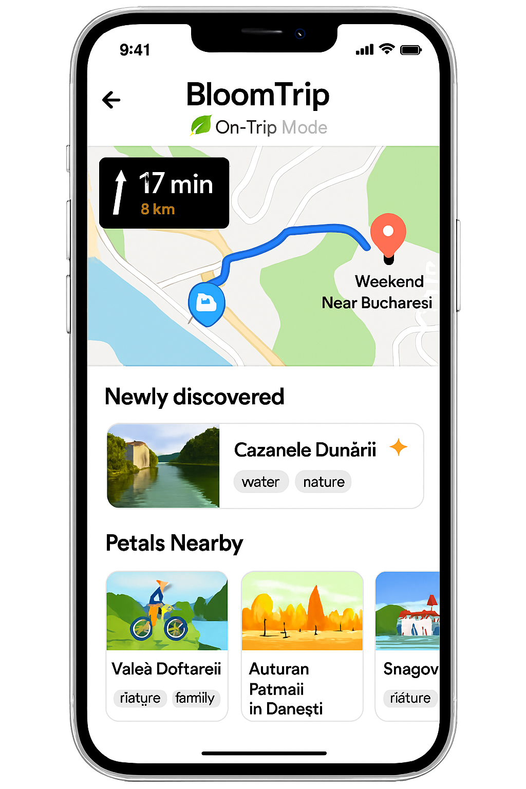

# On-Trip Mode Transition (From Inspiration to Live Navigation)

*Figure 11. On‑Trip Mode (mobile): live map + "Up Next" focus card, Nearby Petals rail, quick navigation/actions, and dynamic discovery banner.*

> Image upload guidance: save the mobile mock as `on-trip-mode-mobile.png` in `docs/mockups/images/`. (Optional desktop variant: `on-trip-mode-desktop.png`.)

## 1. Purpose

Provide a seamless shift from planning / inspiration (dashboard, saved petal, seasonal suggestion) into an in-motion experience that preserves itinerary context while surfacing opportunistic nearby petals.

## 2. Multi-Entry Paths into a Trip

| Entry Source | User Action | Initialization Behavior |
|--------------|------------|--------------------------|
| Seasonal / Promo Card (e.g. Autumn Festival) | Plan This Trip | Seeds Trip Builder with promo petal as Day 1 anchor; derives default date (next weekend) |
| Saved Petal | Add to Trip (no active trip) | Creates draft trip: petal as first activity; prompts for date range |
| Recommended Petal (Suggestions rail) | Start Trip | Generates scaffold (cluster of complementary petals) using preference-weighted retrieval |
| Existing Draft Trip | Continue / Navigate | Enters Trip In Progress state with current day highlighted |
| Direct Deep Link (shared trip) | Open Link | Loads committed trip; offers "Start Navigation" if today within date range |

## 3. State Transition Overview

| State | Source Trigger | Key UI Differences | Caching Notes |
|-------|---------------|--------------------|---------------|
| Builder (Draft) | New plan initialization | Editable sequence, drag & swap, AI refine chips | Retrieval set + draft generation cache |
| Trip In Progress (Pre-Commit) | User shifts focus to execution (e.g. presses Navigate) | Day cards + live map + commit bar | Adds live location polling (opt-in) |
| On‑Trip Mode (Active) | Trip committed + user starts travel | Up Next card pinned, minimized editing, quick actions bar | Location & proximity caches (nearby petals) |
| Post-Trip Recap | End date passed / user completes | Summary metrics, feedback prompts | Feedback submission flushes popularity deltas |

## 4. Core UI Regions (On-Trip Mode)

| Region | Description | Notes |
|--------|-------------|-------|
| A. Live Map | Real-time position, route polyline (current leg) | Minimizes to picture-in-picture on scroll |
| B. Up Next Card | Photo, name, distance, ETA, key tags, Start / Navigate button | Collapsible after arrival detection |
| C. Nearby Petals Rail | Swipeable suggestions within detour threshold (e.g. +10% time) | Excludes current day's locked anchors |
| D. Newly Discovered Banner | Detected off-route or user-tapped unsaved Petal | One-tap Save or Add to Trip (inserts into current day tail) |
| E. Quick Actions Bar | Swap Activity, Navigate (Google/Apple/Waze), Save for Later, Refresh Suggestions | Hides when keyboard up |
| F. Status & Progress Strip | Completed count / remaining, daylight/time warnings | Simple icon + tooltip pattern |

## 5. Live Data & Refresh Strategy

| Data | Frequency | Mechanism | Notes |
|------|----------|-----------|-------|
| Location | 5–10s (dynamic) | Geolocation API / native bridge | Adaptive interval (slower when stationary) |
| Route ETA | On significant movement or segment change | Provider API (rate-limited) | Fallback to precomputed segment durations |
| Nearby Petals | Every 2 min or >300m deviation | Geo-filtered hybrid search + tag weighting | Cache window 2–5 min |
| Weather Alerts (optional) | 30 min | Third-party weather API | Show only impactful alerts |

## 6. Personalization & Suggestion Logic

Algorithm (simplified):

1. Base retrieval: geo radius (dynamic by travel mode) + profile favorite_tags.
2. Filter out already scheduled petals + recently dismissed.
3. Diversify by tag cluster if top results homogenous >60%.
4. Apply novelty boost for petals similar to discovered but unsaved.
5. Rank by composite: `0.5 * relevance + 0.2 * proximity_score + 0.2 * novelty + 0.1 * popularity`.

## 7. Telemetry Events

| Event | Payload Example |
|-------|-----------------|
| ontrip_view | { tripId, userId, dayIndex, mode:"drive" } |
| ontrip_nearby_refresh | { tripId, count, radiusMeters } |
| ontrip_navigate_launch | { tripId, provider:"google", segmentId } |
| ontrip_discovered_show | { tripId, petalId } |
| ontrip_discovered_save | { tripId, petalId } |
| ontrip_swap_invoke | { tripId, fromPetal, toPetal } |
| ontrip_upnext_arrival | { tripId, petalId, driftSeconds } |
| ontrip_feedback_prompt | { tripId, timing:"end_of_day" } |

## 8. Edge Cases

| Scenario | Handling |
|----------|----------|
| Offline mid-route | Preserve last route polyline + Up Next details; disable refresh; queue saves |
| GPS drift / low accuracy | Show accuracy ring; delay arrival detection until stable |
| No nearby petals | Expand radius once; then show "Enjoy the journey" placeholder |
| Excess suggestions churn | Debounce refresh; diff highlight only net-new cards |
| Arrival detection failure | Manual "Mark Arrived" button reveals after ETA + threshold |

## 9. Accessibility

- Up Next card structured as landmark with heading for next destination.
- Nearby rail: list semantics + roving tabindex for swipeable cards.
- High-contrast map overlay icons; avoid color-only encoding for status.
- Motion-reduced mode: disable map auto-pan, provide textual distance updates.

## 10. Security & Privacy

| Concern | Mitigation |
|---------|-----------|
| Continuous location exposure | Local-only; server gets coarse region unless user opts in to live share |
| Sensitive companion info in logs | Exclude companion tags from telemetry payloads |
| Hallucinated dynamic suggestions | Source annotations + retrieval ID hash stored for audit |

## 11. Future Enhancements

- Live collaborative markers (friends en route).
- Energy / battery-aware suggestion filtering (e-bike range).
- Predictive prefetch of likely next 2 segments for offline resilience.
- Passive learning of detour tolerance to tune proximity scoring.

---
Figure 11 added: 2025-09-05 (image placeholder `on-trip-mode-mobile.png`).

Cross-links: `trip-in-progress.md`, `navigation-picker.md`, `user-dashboard.md`, `petal_schema.md`.