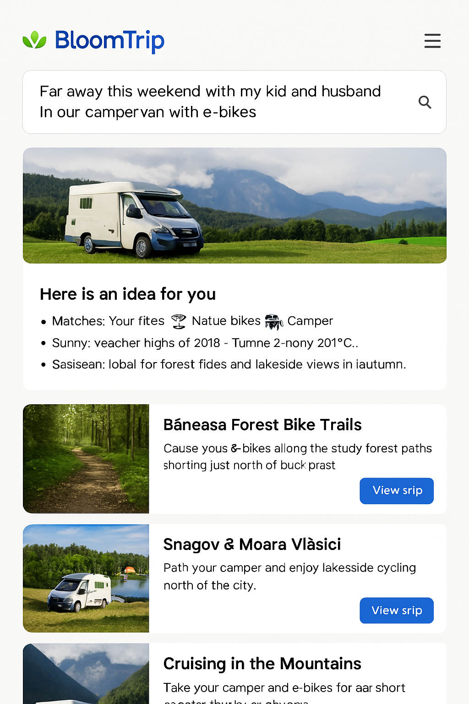
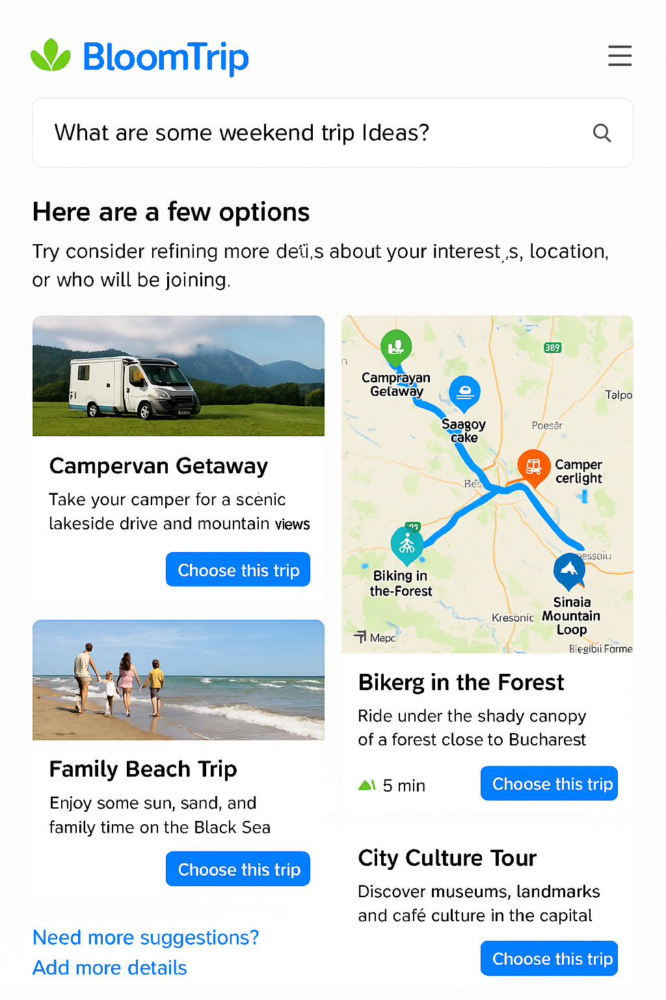

# Search Refinement Mockup

*Figure 1. Divergent results view prompting the user to refine an overly broad weekend trip query.*

## Scenario: Broad Search Results
When a user’s search prompt is too broad, BloomTrip provides diverging trip ideas and suggests refining the search further.

---

## Mockup

### Search Results

*Figure 2. Mobile variant showing stacked trip idea cards; refinement CTA remains visible below list.*

Here are a few options based on your search:

1. **Campervan Getaway**
   - Take your camper for a scenic lakeside drive and mountain views.
   - [Choose this trip]

2. **Biking in the Forest**
   - Ride under the shady canopy of a forest close to Bucharest.
   - [Choose this trip]

3. **Family Beach Trip**
   - Enjoy some sun, sand, and family time on the Black Sea.
   - [Choose this trip]

4. **City Culture Tour**
   - Discover museums, landmarks, and café culture in the capital.
   - [Choose this trip]

---

### Refinement Suggestions
To refine your search, consider adding more details about:
- Interests (e.g., biking, hiking, cultural tours)
- Location (e.g., nearby cities, specific regions)
- Companions (e.g., family, friends, pets)

---

### After Choosing a Trip

#### Trip Details Page
- **Hero Image**: Showcase the destination/activity.
- **Why It’s a Match**: Display weather, distance, and profile tags (e.g., 🚲 E‑bikes • 🌲 Nature • 🚐 Camper).
- **Day-by-Day Itinerary**: Include times, activities, and optional swaps.
- **Interactive Map**: Plot all stops with custom BloomTrip icons.

#### Personalization Options
- Swap Activity: Replace a hike with a museum or a long ride with a shorter loop.
- Adjust Duration: Stretch a 1‑day trip into a 2‑day trip or vice versa.
- Add Companions: Tweak suggestions for kids, pets, or extra friends.
- Budget Filter: See options that fit a spending range.

#### Logistics & Resources
- Driving directions (Google/Bing Maps link).
- E‑bike charging points, campervan parking, and food stops.
- Weather forecast for each day.
- Links to source content (e.g., Komoot route, local event page).

#### Save & Share
- Save to My Trips: Add to the user’s profile for later.
- Share: Send a link to friends/family with the full itinerary.
- Export: Download as a PDF or sync to a calendar.

#### Feedback Loop
After the trip, users can:
- Rate each activity.
- Mark favorites.
- Mute things they didn’t enjoy.

This feedback improves future recommendations.
