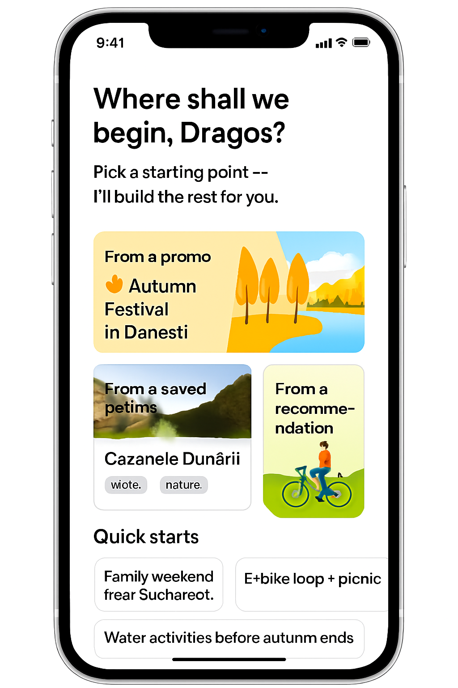

# Trip Builder Start Screen (Entry Point Selector)

*Figure 12. Trip Builder Start Screen (Mobile): single-column hero prompt with vertically stacked entry tiles and horizontal Quick Starts rail for rapid itinerary seeding.*

## 1. Purpose
Remove friction at the very beginning of planning by letting the user begin from any "spark" (promo, saved, recommendation, theme) and immediately preview a scaffolded Day 1.

## 2. Hero Prompt
Primary text: **“Where shall we begin, Dragos?”**  
Subtext: *Pick a starting point — I’ll build the rest for you.*

Behavior: fades once a starting tile is chosen; replaced by compact trip title editor.

## 3. Entry Tiles

| Tile | Source | Default Content | Tap Outcome | Notes |
|------|--------|-----------------|------------|-------|
| From a Promo | Seasonal / trending campaign (e.g. 🍂 Autumn Festival in Dănești) | Hero image + season tag | Seeds draft with promo petal as anchor, pre-fills date (next weekend) | Pulls from curated promo feed |
| From a Saved Petal | UserProfile.saved_petals (recent / most-loved) | Real photo + tags | Draft trip with that petal as Day 1 Activity 1 | Ranking by recent interaction weight |
| From a Recommendation | AI curated (preferences + season + region) | Illustration / neutral scenic | Generates 2–3 seed petals (cluster) | RAG retrieval + diversity pass |

### Recommendation Generation (Seed)
Steps: profile preference tag weights → hybrid search (region + seasonality) → cluster by tag set → pick top centroid + complementary diversity pair.

## 4. Smart Suggestions (Quick Starts Bar)
Horizontal chip / card rail (scrollable): examples: *Family weekend near Bucharest*, *E‑bike loop + picnic*, *Water activities before autumn ends*.  
Selecting a Quick Start executes a predefined filter/prompt template and opens the builder with initial retrieval set + provisional ordering.

## 5. Instant Builder Preview Transition
On selection:
1. Overlay spinner (<400 ms target) while retrieving seed petals.
2. Slide left-to-right into standard Builder layout (Day 1 + map snippet + suggested add-ons side panel).
3. Show toast: “Draft initialized — refine or add more petals.”

Esc / Back (within 3 s) returns to Start Screen preserving previous selection state.

## 6. Suggested Add‑Ons Panel
| Source | Logic | Placement |
|--------|-------|-----------|
| Nearby complementary | Tag diversity vs seed anchor | Top section |
| Popular in region | Popularity snapshot cache | Middle |
| Personal favorites | Intersect favorite_tags | Lower |
| Seasonal expiring | Season end proximity | Highlighted badge |

## 7. Merge Into Active Trip (While Traveling)
If user is already in On‑Trip Mode and launches a Promo:
- Offer dialog: **“Add to current trip or start new?”**  
- Choosing *Add* inserts promo petal into next available compatible time slot (conflict check: duration + travel delta) and regenerates local route polyline.

## 8. Telemetry
| Event | Payload |
|-------|---------|
| builder_start_view | { userId } |
| builder_tile_select | { type:"promo|saved|recommendation", petalId?, promoId? } |
| builder_quick_start_select | { templateId } |
| builder_seed_generate | { count, durationMs } |
| builder_merge_into_active | { source:"promo", tripId } |

## 9. Edge Cases
| Scenario | Handling |
|----------|----------|
| No saved petals | Hide Saved tile; show an encouragement to save petals via search |
| No promos active | Replace Promo tile with dynamic recommendation cluster |
| Recommendation retrieval empty | Retry with relaxed geo radius; fallback to popular set |
| Slow seed generation (>2s) | Show progressive skeleton (skeleton tiles) |

## 10. Accessibility
- Tiles: role=button, aria-label includes tile type + primary petal name (if present).
- Quick Start rail: list semantics + focusable chips.
- Provide skip link directly to “Builder Preview” after selection.

## 11. Security & Privacy
| Concern | Mitigation |
|---------|-----------|
| Promo injecting restricted content | Promo curation pipeline validates license_flags before publish |
| Recommendation leakage of private tags | Only surface tags already visible in profile preferences UI |
| Seed hallucination | All seed petals required to have source + source_id citations before acceptance |

## 12. Future Enhancements
- Multi-select starting seeds (e.g. pick 2 saved petals to combine).
- Voice start: “Plan a weekend nature trip.”
- Recently abandoned drafts shortcut.
- A/B test tile ordering vs engagement.

---
Figure 12 added: 2025-09-05 (image `trip-builder-start-mobile.png`).

Cross-links: `user-dashboard.md`, `trip-in-progress.md`, `on-trip-mode-transition.md`, `petal_schema.md`.