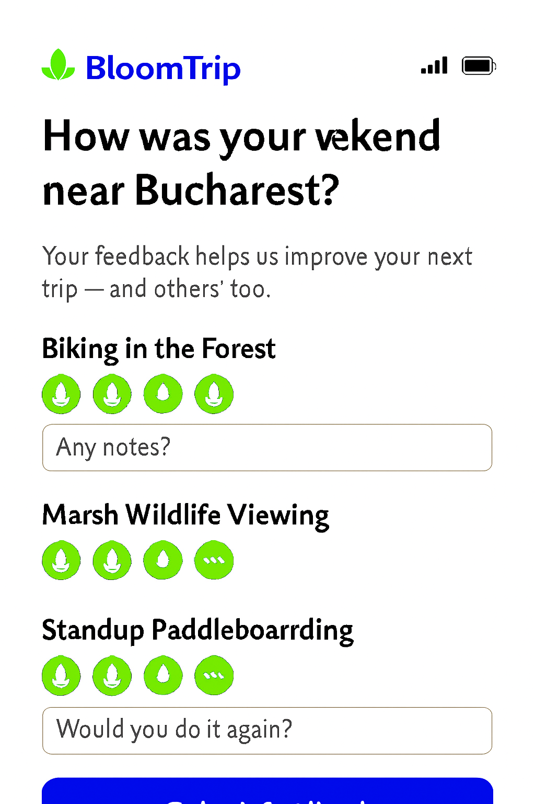

# Post-Trip Feedback Survey (Lightweight Mobile Flow)


*Figure 8. Post-Trip Feedback Survey collecting overall trip rating, per‑petal feedback, discovery input, and follow-up actions to enrich personalization + Popular Petals ranking signals.*

## 1. Purpose

Capture high-signal qualitative + structured feedback immediately after trip completion (or upon user returning to the app) while cognitive context is fresh—fueling: personalization vector updates, Popular Petals scoring, quality moderation, and future trip suggestions.

## 2. Entry Triggers

| Trigger | Condition | Debounce |
|---------|-----------|----------|
| Auto prompt | Trip end date passed + user opens app (≤ 48h) | 1 per trip |
| Manual | User taps “Give Feedback” on trip detail | None |
| Reminder | No response after 24h (push/email optional) | Max 1 reminder |

## 3. Survey Sections

| Section | Elements | Notes |
|---------|----------|-------|
| Header | Trip title, supportive subtext | Dynamic: “weekend near {Region}” |
| Overall Rating | Petal (1–5) or emoji scale | Accepts skip (stores null) |
| Recommend Toggle | Yes / No | Only shown if rating ≥ 3 or user opens details |
| Activity (Per Petal) | Mini card: name, rating 1–4, optional note | Collapsible after rating chosen |
| Discovery Prompt | Open text + autosuggest petals | Suggest list filters out already in library |
| Final Actions | Submit • Save Trip (if not) • Plan Follow-Up | Follow-Up launches generation seed using feedback deltas |

## 4. Data Model (Submission Payload)

```json
{
  "tripId": "forest_lake_weekend_2025_09_13",
  "overall": { "rating": 4, "recommend": true },
  "activities": [
    {"segmentId": "seg_1", "petalId": "baneasa_forest", "rating": 4, "note": "Shady & cool."},
    {"segmentId": "seg_2", "petalId": "snagov_lake", "rating": 3, "note": "Windy midday."}
  ],
  "discoveries": ["hidden_boardwalk", "local_bakery"],
  "freeformDiscovery": "Found a small lakeside kiosk with great lemonade.",
  "clientMeta": {"device": "mobile", "lang": "en"}
}
```

### Normalization

- `discoveries` list items resolved to Petal IDs via fuzzy match or created as candidate petals (pending moderation).

## 5. Signal Derivation

| Signal | Source | Uses |
|--------|--------|------|
| petal_quality_score | Per activity rating | Ranking suppression / boost |
| trip_satisfaction | Overall rating | Personalization weight shift |
| recommend_flag | Recommend toggle | Social proof metrics |
| discovery_yield | Count of new discoveries | User explorer persona weighting |
| friction_flag | Notes containing patterns ("muddy", "closed") | Data freshness / POI status review |

## 6. Telemetry Events

| Event | Payload Example |
|-------|-----------------|
| feedback_view | {tripId, activities:7} |
| feedback_rate_trip | {tripId, rating:4} |
| feedback_rate_petal | {tripId, petalId:"baneasa_forest", rating:3} |
| feedback_discovery_add | {tripId, candidate:"hidden_boardwalk"} |
| feedback_submit | {tripId, overall:4, activitiesRated:6} |
| feedback_followup_generate | {tripId, seed:"follow_up"} |

## 7. Ranking & Personalization Impact

| Component | Update Logic |
|-----------|-------------|
| Popular Petals | Increment weighted counters (recent ratings decay exponentially) |
| User Vector | Fine-tune interest dimensions (e.g., water, forest, cultural) based on high-rated petals |
| Negative Signals | Down-weight low-rated categories in next generation candidate pool |
| Cold Start Aid | Aggregated anonymous averages inform baseline priors |

## 8. Privacy & Compliance

- Freeform notes passed through mild PII scrub (emails, phone numbers masked).
- Discovery submissions flagged for moderation before surfacing publicly.
- User can delete feedback (endpoint `DELETE /api/trips/{id}/feedback`).

## 9. UX Interaction Details

| Pattern | Description |
|---------|-------------|
| Progressive Disclosure | Only first 3 activities expanded; others lazy-expand on scroll |
| Skip Friendly | “Skip for now” returns to trip view; keeps reminder eligibility |
| Micro Animations | Petal rating selection pulses ±5% scale |
| Optimistic Submit | UI disables controls, shows inline success check ✔ |

## 10. Accessibility

- Ratings group uses radiogroup semantics with clear aria-labels.
- Notes text areas support dictation / screen reader hints.
- Focus order: header → overall rating → per-activity groups → discovery prompt → actions.

## 11. Error Handling

| Scenario | Handling |
|----------|----------|
| Network fail on submit | Queue payload locally (IndexedDB) retry w/ backoff |
| Partial ratings only | Accept; missing ratings omitted (null stored) |
| Discovery unmatched | Create tentative candidate (status=`pending`) |
| Duplicate submit | Idempotency key hash of (tripId + userId) prevents double ingest |

## 12. Future Enhancements

- Sentiment analysis on notes → adaptive clarification prompt.
- Inline photo attachment for activity evidence.
- “Auto plan follow-up” wizard seeding delta preferences (e.g., more water activities next time).

---
Figure 8 added (image pending upload as `trip-feedback-survey.png`).

---
Cross-links: `trip-in-progress.md`, `itinerary-refinement-detail.md`, `navigation-picker.md`
