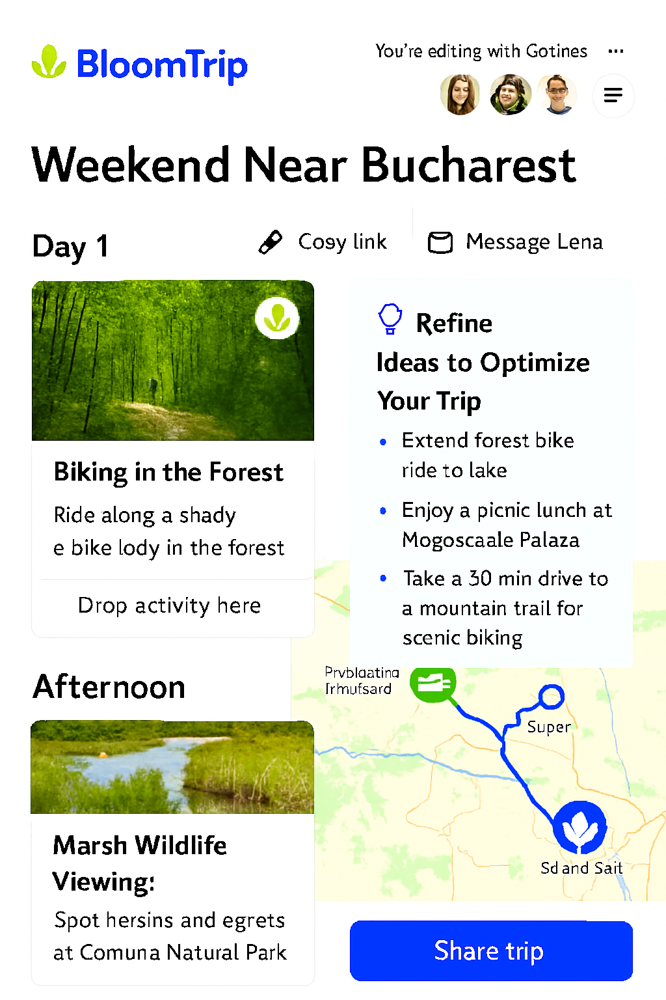

# Trip In Progress View (Pre-Commit Flex State)

*Figure 6. Trip In Progress view showing a nearly finalized weekend plan: day-by-day cards, interactive route map, Petals rails (Saved & Popular), AI refinement suggestions, and a prominent Save Trip action before commit.*

## 1. Purpose

Bridge the gap between active refinement and a committed itinerary. The user perceives the plan as “almost done” yet still malleable for micro-optimizations (timing, insertion, swaps) before locking and sharing.

## 2. Key UI Regions

| Region | Description | Notes |
|--------|-------------|-------|
| A. Trip Header | Title, date window (editable pre-commit), profile match tags | Shows match confidence + weather band summary |
| B. Day Column(s) | Ordered day cards with segment blocks | Inline edit for time & duration still enabled |
| C. Live Map | Route polyline + markers with semantic icons | Auto-updates on Petal insertion or swap |
| D. Petals Rail (Saved) | User’s previously saved activities | Filter + search + drag source |
| E. Petals Rail (Popular) | Community-surfaced high-engagement petals | Ranked by recency * popularity score |
| F. Smart Suggestions | Contextual AI improvement chips | Each chip triggers a delta retrieval/refine |
| G. Commit Bar | Save Trip, Share (disabled until saved), Export | Save transitions to immutable baseline state |
| H. Activity Insight Hover | Quick reason + provenance tooltip | Pulled from original generation + RAG citations |

## 3. State Model

| State | Editable? | Map Sync | Sharing | Notes |
|-------|----------|----------|---------|-------|
| InProgress | YES (segments, timing, companions) | Real-time | Disabled | Default after choosing a trip |
| Saving | Locked (optimistic) | Paused until success | Disabled | Shows spinner on Commit Bar |
| Committed | NO (structural); notes still editable | Stable snapshot + version tag | Enabled | Version = v1 baseline |
| Collaborative (future) | Limited (suggestion mode) | Real-time | Link-based | Pending share feature |

## 4. Save Trip Flow

1. User clicks Save Trip.
2. Frontend assembles normalized itinerary JSON (segments, ordering, POI references, computed aggregates: totalDriveMin, totalRideMin, elevationGain, tag frequencies).
3. POST `/api/trips` → returns `tripId` + `version=1`.
4. UI transitions to Committed state; Share/Export buttons enable; delta refinement actions reduce (swap & insert now open a “Create revision?” prompt).

### Idempotency

Client sends a `clientDraftId` to avoid duplicate saves if network retries.

## 5. Petals Integration

| Aspect | Behavior |
|--------|----------|
| Saved Petals | User-curated set (manual saves + post-trip favorites) |
| Popular Petals | Aggregated by region + activity tag (rolling 30d window) |
| Ranking Signals | insert_count, save_count, completion_rate, dwell_ms, implicit boosts (matching user profile tags) |
| Drag & Drop | Shares mechanics defined in Figure 5 (Refinement Detail) |
| Conflict Check | Pre-drop cost: added drive mins + daylight window feasibility |

## 6. AI Suggestion Logic (Pre-Commit)

| Trigger | Example Chip | Scope |
|---------|--------------|-------|
| Missing meal anchor | "Add a scenic lunch stop" | Day window (midday slot) |
| Overloaded afternoon | "Shorten final ride before sunset" | Affected segments only |
| Weak diversity | "Insert a cultural break" | Gap between long homogeneous activities |
| High idle gap | "Fill early evening with light activity" | Gap prompt |

## 7. Telemetry (Incremental to Refinement View)

| Event | Payload |
|-------|---------|
| trip_inprogress_view | {tripId, userId, entrySource:"refinement\|resume"} |
| trip_save_invoke | {tripId, draftHash, segmentCount} |
| trip_save_success | {tripId, version, latencyMs} |
| trip_save_error | {tripId, errorCode} |
| petal_list_scroll | {tripId, list:"saved\|popular", scrollDepthPct} |
| suggestion_chip_show | {tripId, chipType} |

## 8. Delta Regeneration Constraints vs Pre-Commit

- Hard cap on concurrent pending delta tasks: 2
- If user tries a third: toast “Finish pending adjustments first.”
- Prevent full itinerary regeneration unless user explicitly clicks “Rebuild day”.

## 9. Accessibility

- Distinct ARIA landmarks for Day List, Petals Rails, Suggestion Panel.
- Drag & drop alternative via: Select Petal → Choose Insertion Slot dialog.
- Snackbar announcements on save success/failure.

## 10. Post-Commit Transition (Preview)

After commit: new doc (future) “Share & Collaborate” will define: invite links, suggestion mode, revision diffs (v1 → v2), and annotation layer for proposed changes.

---
Figure 6 added: 2025-09-05
