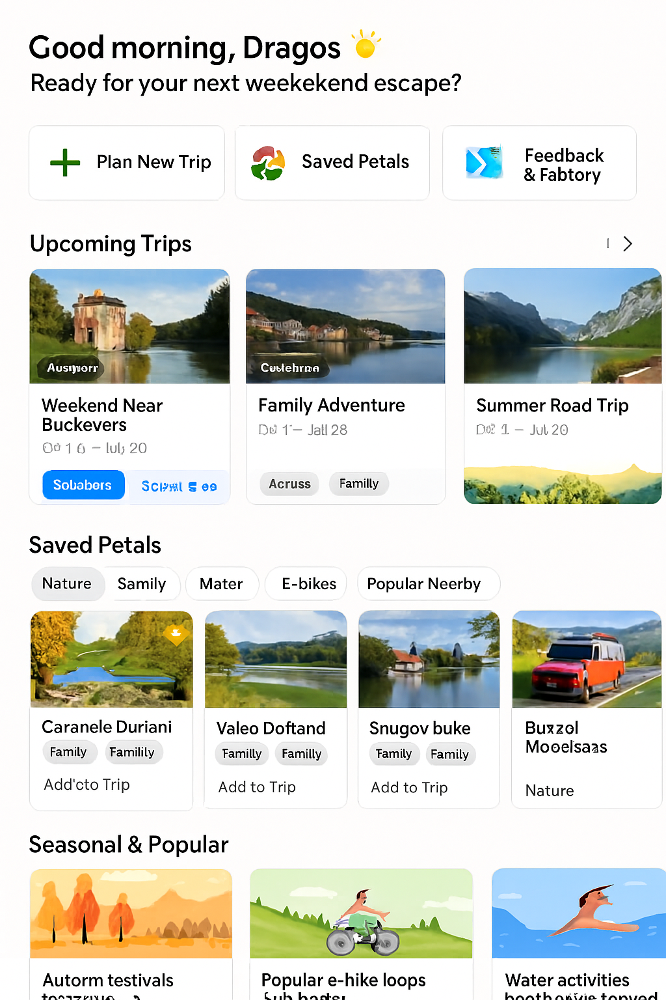
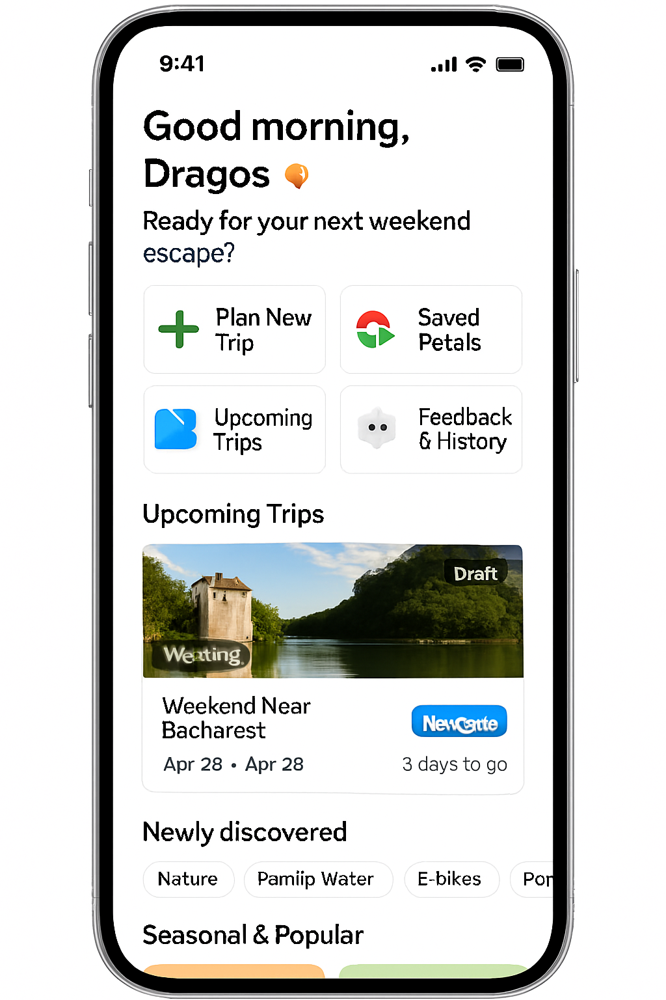

# User Dashboard (Personal Travel Hub)

> Image asset naming guidance (add these PNGs to `mockups/images/` and I'll wire them automatically):
> - Desktop: `user-dashboard-desktop.png`
> - Mobile: `user-dashboard-mobile.png`
> (Optional combined hero you already have: `dashboard.png` – retained below.)

*Figure 10a. Desktop User Dashboard: full-width layout with horizontal trip carousel, multi-column saved petals grid, seasonal rails, and feedback impact panel.*

*Figure 10b. Mobile User Dashboard: condensed thumb-first stack prioritizing next actions (navigate, add petal, continue planning) and swipeable rails.*

*Figure 10. Composite (legacy) dashboard mock placeholder kept until dedicated desktop/mobile variants are added.*

## 1. Purpose

Provide a personalized, low-latency landing surface that answers: "What should I do next?" while showcasing progress (upcoming trips) and discovery (seasonal/popular petals) aligned with profile preferences.

## 2. Top Layout Structure (Unified Concept)

| Zone | Description | Primary Actions | Data Sources |
|------|-------------|-----------------|--------------|
| Greeting & Quick Actions | Personalized welcome ("Good morning, Dragos 🌞 — ready for your next weekend escape?") + time-of-day context | Plan New Trip, Saved Petals, Upcoming Trips, Feedback & History | UserProfile + time-of-day heuristic |
| Upcoming Trips | Cards (desktop: horizontal carousel; mobile: single primary + pager dots) with name, dates, status, countdown, navigate button | Open Trip, Navigate, Edit | Trip Schema, cached travel metrics |
| Saved Petals Library | Filter chips (Nature, Family, Water, E‑bikes, Popular Nearby) + grid/list (responsive) + newly discovered highlight | Add to Trip, Remove Save, Open Detail | Petal Schema, saved_petals, discovered_petals |
| Seasonal & Popular Suggestions | Curated rails (autumn festivals, e‑bike loops, water activities) blended with profile preferences | View Petal, Add to Trip | Popularity cache + preference weights + seasonality |
| Feedback & History | Recent trips recap links, ratings distribution, "Your impact" RAG summary | Open Recap, Rate Missed Petals | Trip feedback, petal_feedback, popularity deltas |
| Notifications & Nudges | Contextual actionable prompts (events, proximity, expiring seasonal items) | Accept (add), Dismiss | Rules engine (events + geo + calendar) |

## 3. Core Component Definitions

| Component | Fields / Elements | Notes |
|-----------|------------------|-------|
| Quick Action Tile | icon, label, hotkey, aria-label | Large hit area (min 44px) |
| Trip Card | cover_image, title, date_range, status_badge, countdown, navigate_btn | Countdown if start_date > now |
| Petal Tile | thumbnail, name, tags (max 3), add_to_trip_btn, new_badge | New badge for discovered within last trip session |
| Suggestion Card | emoji/icon, title, reason_tag (e.g. "seasonal"), add_btn | Explanation improves trust |
| Ratings Summary | avg_rating, top_tag, total_reviews | Derived nightly cached aggregate |
| Impact Banner | text_dynamic, influenced_count | Generated via RAG summary template |
| Notification Item | message, cta_label, dismiss | Distinct icon per rule category |

## 4. Data & Query Strategy

- Saved petals: single batched lookup (IDs → petals) with partial projection.
- Upcoming trips: limit to next 3 sorted by start_date; prefetch active trip details.
- Seasonal suggestions: Redis key `popular:petals:{region}:{season}` + personalization rerank.
- Impact narrative: RAG template combining (petal_feedback deltas + popularity shifts).

### Example Impact Narrative Prompt (System Instruction Excerpt)
"Generate a concise (<= 28 words) positive summary of how the user's recent ratings influenced popularity. Use concrete category or tag names. Avoid exaggeration."

## 5. Caching & Performance

| Data Slice | Cache Layer | TTL | Invalidation |
|------------|-------------|-----|-------------|
| Saved Petal IDs | profile core cache | 5m | On add/remove save |
| Petal Tile Projection | retrieval/petal object | 10m | Petal freshness trigger |
| Seasonal Rail | popularity snapshot | 30m | Popularity recompute job |
| Impact Narrative | semantic response cache | 2h | New feedback submission |
| Upcoming Trips Summary | trip read model | 10m | Trip mutation |

## 6. Personalization & RAG Integration

- Seasonal rails filtered by region + seasonality + profile.favorite_tags.
- RAG summarizer generates "Your impact" and optional micro-suggestions (e.g., suggest rating missed petals).
- Diversification heuristic ensures at least one exploratory (non-overlapping tag set) suggestion if cluster homogeneity > 60%.

## 7. Telemetry Events

| Event | Payload Fields (Example) |
|-------|--------------------------|
| dashboard_view | { userId, savedCount, upcomingTrips, season:"autumn" } |
| dashboard_click_quick_action | { action:"plan_trip" } |
| dashboard_trip_card_open | { tripId, status } |
| dashboard_navigate_launch | { tripId, provider:"google" } |
| dashboard_petal_add_to_trip | { petalId, tripContext? } |
| dashboard_suggestion_impression | { petalId, rail:"autumn_festivals" } |
| dashboard_feedback_banner_open | { tripId } |
| dashboard_notification_accept | { ruleId } |
| dashboard_notification_dismiss | { ruleId } |

## 8. Edge Cases & Fallbacks

| Scenario | Handling |
|----------|----------|
| No upcoming trips | Show CTA card: "Plan your next escape" |
| No saved petals | Replace grid with onboarding tips (add via search) |
| Low seasonal content | Expand radius or fallback to popular evergreen petals |
| Offline mode | Serve last cached snapshot + disable actions needing network |
| API latency spike | Skeleton loaders + staggered fade-in |
| Empty feedback history | Invite to rate past trip(s) via recap prompt |

## 9. Accessibility

- All interactive tiles: 44x44 min, focus outline AA contrast.
- Landmark roles: header (greeting), main (content rails), complementary (feedback panel), region labels for carousels.
- Provide skip links to "Saved Petals" and "Suggestions" sections.
- ARIA live region for notifications insertion.

## 10. Security & Privacy Notes

| Concern | Mitigation |
|---------|-----------|
| Exposure of private trip titles in shared device | Obfuscate ("Trip 1") when privacy mode enabled |
| Over-personalized notifications leaking companion info | Avoid explicit companion names in banner text |
| Feedback narrative hallucination | Constrain prompt with numeric anchors (counts, rating deltas) |

## 11. Future Enhancements

- Collaborative activity feed (recent edits by collaborators).
- Inline trip quick-ref panel (next upcoming day's first 3 activities).
- A/B testing rail placements (engagement vs decision latency).
- Dynamic theming based on dominant seasonal palette.

## 12. Implementation Checklist

## 13. Mobile Adaptation Details

| Aspect | Desktop | Mobile |
|--------|---------|--------|
| Quick Actions | 4 tiles in a single row (wide) | 2x2 grid or horizontal scroll row |
| Upcoming Trips | Multi-card carousel (peek of next) | Single primary card + swipe/pager |
| Saved Petals | 3–4 columns grid | 1–2 column adaptive; horizontal chip scroll |
| Seasonal Rails | Full-width with 4 visible cards | Snap carousel (1.2 card width) |
| Feedback Panel | Right-side / lower section | Collapsible accordion near bottom |
| Notifications | Inline right column or top bar badge | Sticky drawer / slide-up sheet |

Gestures (Mobile):

- Horizontal swipe: trip cards, seasonal rails, saved petals filters.
- Long-press petal: quick add/remove saved state.
- Swipe notification left: dismiss; right: accept (if additive action).

Performance Considerations:

- Defer seasonal rails below fold (IntersectionObserver) to reduce initial payload.
- Use speculative prefetch for the most-likely next trip (based on imminence).

## 14. Tech Notes (Expanded)

| Concern | Implementation |
|---------|---------------|
| Fast petal search/filter | Azure AI Search hybrid; precomputed facet counts cached |
| Image tagging & translation | Cognitive Services Vision + Translator queued enrichment on ingestion |
| Review summarization | Cognitive Services Language (summarization) -> persisted summary field |
| Seasonal suggestion generation | RAG: popularity snapshot + profile tag weights + prompt template |
| Impact narrative | RAG with constrained numeric anchors (rating deltas, top tag) |
| Caching tiers | Redis: profile core, retrieval sets, popularity snapshot, semantic narrative |
| Notification rules | Event ingestion -> lightweight rules engine (Functions) -> queue -> user feed store |
| Latency target | P95 < 600 ms warm (excluding large image loads) |

## 15. Open Questions

- Should notifications unify with trip-specific alerts (single feed) or remain dashboard-scoped?
- Do we allow inline editing of trip title from card?
- How aggressive should exploratory suggestion diversification be (A/B)?

| Item | Status |
|------|--------|
| Quick action tile component | Planned |
| Trip carousel w/ countdown logic | Planned |
| Saved petals grid + filters | Planned |
| Seasonal rails retrieval + rerank | Planned |
| RAG impact summary endpoint | Planned |
| Notification rules engine | Planned |
| Telemetry ingestion mapping | Planned |
| Accessibility audit pass | Planned |

---
Figure 10 / 10a / 10b added: 2025-09-05 (placeholders `dashboard.png`, `user-dashboard-desktop.png`, `user-dashboard-mobile.png`).

Cross-links: `trip-in-progress.md`, `petal_schema.md`, `trip_schema.md`, `user_profile_schema.md`, `rag_pipeline.md`.
Additional Link: See `on-trip-mode-transition.md` for the in-motion experience after commit / start.
